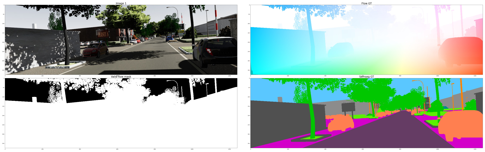
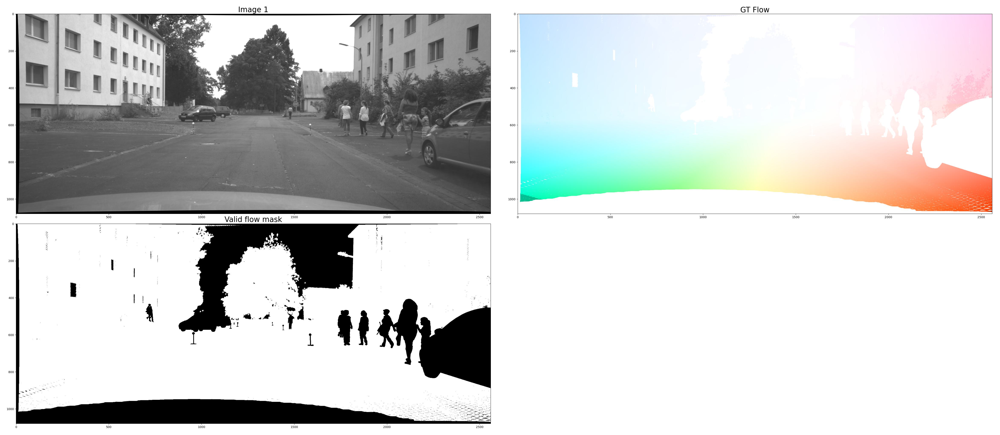
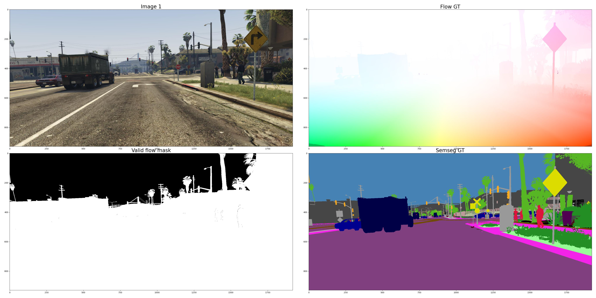

# Optical flow datasets

## Summary

| **Dataset**    | **Size**                                  | **Resolution** | **Sparse/dense flow GT** | **Real world/synthetic**                                   | **Has semseg GT** |
|----------------|-------------------------------------------|----------------|--------------------------|------------------------------------------------------------|-------------------|
| FlyingChairs   | 22K                                       | 512x384        | Dense                    | Synthetic; 3D chair models overlaid on static backgrounds  | No                |
| FlyingThings3D | 39K                                       | 960x540        | Dense                    | Synthetic; 3D object models overlaid on static backgrounds | No                |
| Sintel         | 1041                                      | 1024x436       | Dense                    | Synthetic; 3D movie scenes                                 | No                |
| KITTI          | 200                                       | 1242x375       | Sparse                   | Real world; driving scenarios                              | Yes               |
| Virtual KITTI  | 21K                                       | 1242x375       | Dense                    | Synthetic; driving scenarios                               | Yes               |
| VIPER          | Train/validation/test split: 134K/50K/70K | 1920x1080      | Dense                    | Synthetic; driving scenarios                               | Yes               |
| HD1K           | 1047                                      | 2560x1080      | Sparse                   | Real world; driving scenarios                              | No                |

## Virtual KITTI 2
Official page: https://europe.naverlabs.com/research/computer-vision/proxy-virtual-worlds-vkitti-2/

### Features
* Stereo RGB images
* 5 sequences, 21K frames
* Different camera positions and environmental conditions:
    - Horizontal rotations of camera (15, 30 degrees)
    - Weather effects (fog, clouds, rain)
    - Time of day (morning, sunset)
* Ground truth for multiple tasks:
    - Semantic segmentation
    - Instance segmentation
    - Object detection and tracking
    - Depth
    - Optical flow (backward/forward)
    - Scene flow (backward/forward)
* 15 semantic classes: colors.txt

Sample:

## HD1K
Official page: http://hci-benchmark.iwr.uni-heidelberg.de/

### Features
* Stereo and optical flow GT with uncertainty
* Variations in weather and lighting conditions:
    - Dawn and night scenarios
    - Lens flare and reflections
    - Raindrops on windshield

### Limitations
* No ground truth for dynamic objects
* No semantic segmentation GT
* Urban scenario only, all sequences recorded on same street block

Sample:

## VIPER
Official page: https://playing-for-benchmarks.org/overview/

### Features
* Ground truth for multiple low-level and high-level vision tasks
    - Semantic segmentation
    - Instance segmentation
    - Object detection and tracking
    - Optical flow (sub-pixel accuracy)
    - Visual odometry
* More diverse (sub-)urban scenarios and environmental conditions
* 254K frames in total
    - Train/validation/test split: 134K/50K/70K
    - Each split covers geographically distinct areas
    - Balanced distribution for environmental conditions
    - For optical flow, can use all frames or every 10th frame and its pair => 13K frames
* New evaluation metric for flow: Weighted Area Under the Curve (WAUC)
* 31 semantic classes: https://github.com/srrichter/viper/blob/master/classes.csv

Sample:
